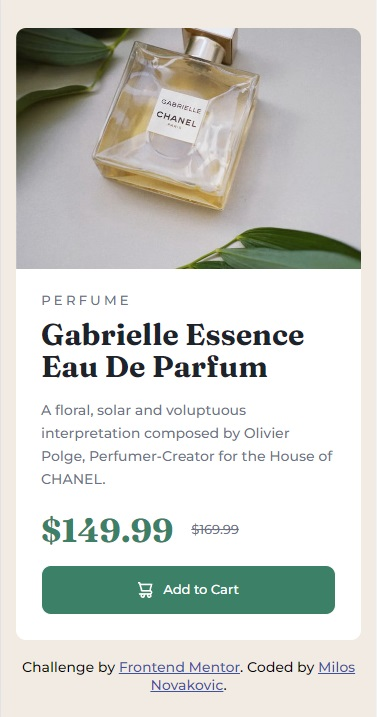
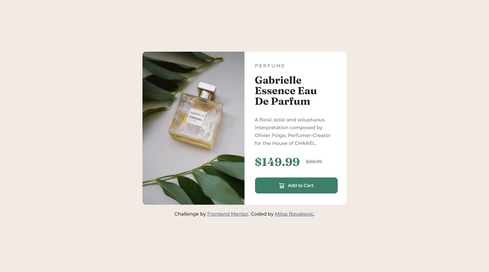

# Frontend Mentor - Product preview card component solution

This is a solution to the [Product preview card component challenge on Frontend Mentor](https://www.frontendmentor.io/challenges/product-preview-card-component-GO7UmttRfa). Frontend Mentor challenges help you improve your coding skills by building realistic projects. 

## Table of contents

- [Overview](#overview)
  - [The challenge](#the-challenge)
  - [Screenshot](#screenshot)
  - [Links](#links)
- [My process](#my-process)
  - [Built with](#built-with)
  - [What I learned](#what-i-learned)
  - [Continued development](#continued-development)
  - [Useful resources](#useful-resources)
- [Author](#author)

## Overview

### The challenge

Users should be able to:

- View the optimal layout depending on their device's screen size
- See hover and focus states for interactive elements

### Screenshot
<div>
  
  
</div>

### Links

- Solution URL: [My solution URL](https://github.com/MiloosN5/FrontendMentor_ResultsSummaryComponent_Challenge)
- Live Site URL: [My live site URL](https://miloosn5.github.io/FrontendMentor_ResultsSummaryComponent_Challenge/public/)


## My process

### Built with

- Semantic HTML5 markup
- SASS - compiled into the CSS
- BEM
- Flexbox
- Mobile-first workflow
- REM (Root EM) & EM (for Responsive)
- Responsive layout
- NPM

### What I learned

* Along with responsive layout, this project was helpful to understand making images responsive using <picture> tag. 
* Relations between texts helped you to understand typographic hierarchy - when to choose paragraph or headings for instance.
* In this case, the hover effect on the button was useful to see how absolute element are relative to its parent. In addition, since the clicking did not redirect you to other page but made a action of submitting, it can helped you understand the difference between <button> and <a> tags.


  * responsive image
  ```html
    <main class="perfume">
        <picture class="perfume__image">
            <source media="(min-width: 56.25em)" srcset="images/image-product-desktop.jpg" >
            
        </picture>
        ...
    </main>
  ```
  * paragraph & headings & BEM
  ```html
      <section class="perfume__details">
          <h3 class="perfume__details__subtitle">Perfume</h3>
          <h1 class="perfume__details__maintitle">Gabrielle Essence Eau De Parfum</h1>
          <p class="perfume__details__description">
            A floral, solar and voluptuous interpretation composed by Olivier Polge, 
            Perfumer-Creator for the House of CHANEL.
          </p>
          <div class="perfume__details__prices">
              <h2 class="perfume__details__prices__discountPrice">$149.99</h2>
              <p class="perfume__details__prices__regularPrice">$169.99</p>
          </div>
          <button class="perfume__details__addToCart">
              
              <span class="perfume__details__addToCart__cartText">Add to Cart</span>
          </button>
      </section>
  ```
  * button (hover effect)
  ```css
    &::before {
        content: '';
        position: absolute;
        width: 100%;
        height: 100%;
        top: 0;
        background-color: g.$dark-cyan-hover;
        opacity: 0;
        transition: opacity 0.5s;
        border-radius: 10px;
    }
    &:hover::before {
        opacity: 1;
    }
  ```

### Continued development

Aspiration to improve the SASS organization (using partials).

### Useful resources

- [CoderCoder (Youtube)](https://www.youtube.com/watch?v=jfMHA8SqUL4) - Getting to know the basics of the SASS.
- [SASS](https://sass-lang.com/documentation/at-rules) - You can found detailed documentation on the official page of the SASS. Check out for example "at-rules".
- [Media Query](https://css-tricks.com/a-complete-guide-to-css-media-queries/) - A Complete Guide to (CSS) Media Queries.
- [Positioning](https://www.freecodecamp.org/news/css-positioning-position-absolute-and-relative/) - Understanding relation between absolute and relative elements.
- [Responsive images](https://developer.mozilla.org/en-US/docs/Learn/HTML/Multimedia_and_embedding/Responsive_images) - How to make images responsive.
- [Typographic Hierarchy](https://www.toptal.com/designers/typography/typographic-hierarchy) - Understanding your website structure/hierarchy sometimes can be difficult. Determing accurately typography can be half job done. 

## Author

- GitHub - [MiloosN5](https://github.com/MiloosN5)
- Frontend Mentor - [@MiloosN5](https://www.frontendmentor.io/profile/MiloosN5)


